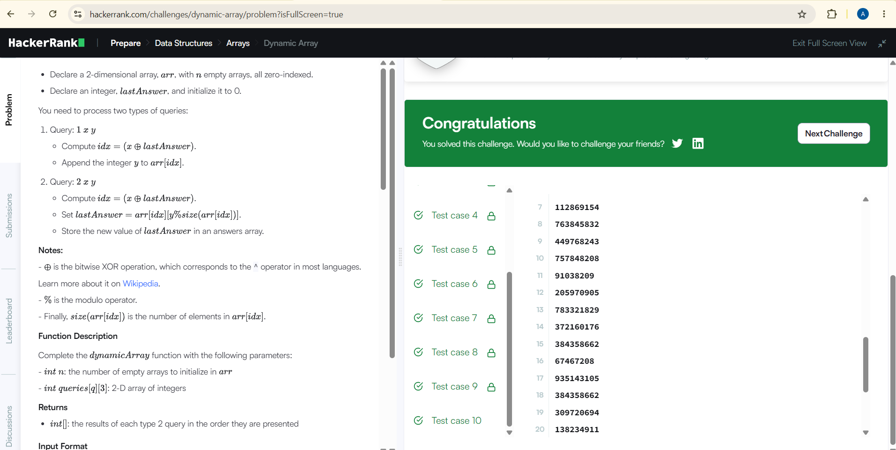

# Dynamic Array

## Problem Description

You have `N` empty sequences and must process a number of queries.

There are two types of queries:

- Type 1: Add an integer to a sequence.
- Type 2: Retrieve an element from a sequence and update `lastAnswer`.

The sequence is selected using the XOR operation:

`(x ^ lastAnswer) % N`

## Approach

- Create `N` empty sequences using a vector of vectors.
- For Type 1 queries, calculate the sequence index and append `y`.
- For Type 2 queries, calculate the sequence index.
- Retrieve the required element using `y % sequence.size()`.
- Store each `lastAnswer` in the result vector.
- Return all results.

## Complexity Analysis

- Time Complexity: O(N + Q)
- Space Complexity: O(N)

## HackerRank

Problem: Dynamic Array

Language: C++20

Status: Accepted

## Result

