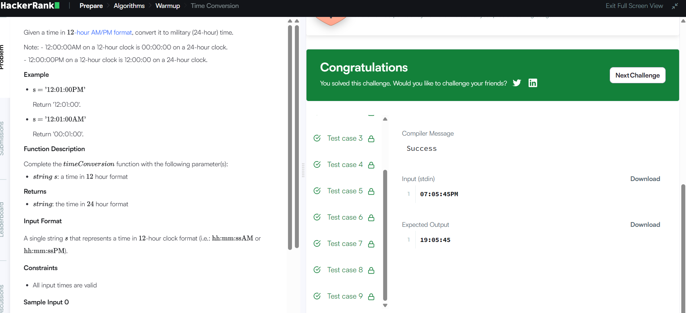

# Time Conversion

## Problem Description

Convert a time from 12-hour AM/PM format to 24-hour military time format.

## Approach

- Extract the hour and AM/PM period.
- For AM, convert 12 AM to 00.
- For PM, add 12 to the hour unless the hour is already 12.
- Keep the minutes and seconds unchanged.
- Return the converted time.

## Complexity Analysis

- Time Complexity: O(1)
- Space Complexity: O(1)

## HackerRank

- Problem: Time Conversion
- Language: C++20
- Status: Accepted

## Result

