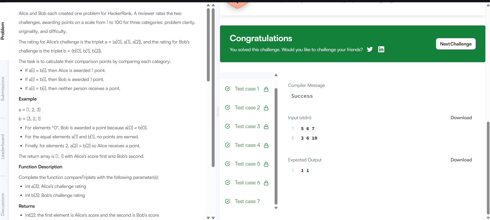

# Compare the Triplets

## Problem Description

Compare Alice's and Bob's three ratings.

- If Alice's rating is greater, Alice gets one point.
- If Bob's rating is greater, Bob gets one point.
- If both ratings are equal, neither gets a point.

Return the scores of Alice and Bob.

## Approach

- Compare the corresponding elements of the two arrays.
- Increase Alice's score when her value is greater.
- Increase Bob's score when his value is greater.
- Return both scores.

## Complexity Analysis

- Time Complexity: O(1)
- Space Complexity: O(1)

## HackerRank

- Problem: Compare the Triplets
- Language: C++20
- Status: Accepted

## Result

