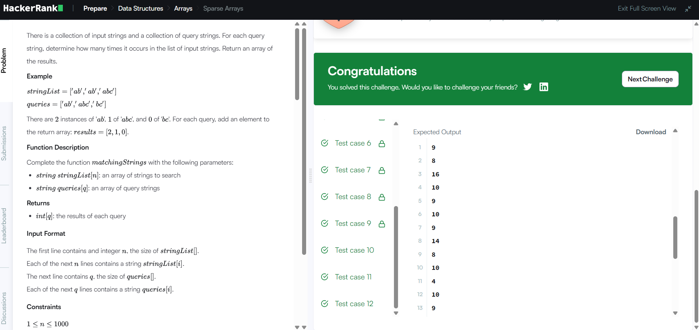

# Sparse Arrays

## Problem Description

Given a collection of strings and a list of query strings, find how many times each query string occurs in the collection.

## Approach

- Use an unordered map to store the frequency of each string.
- Traverse the input strings and increase their frequency.
- Traverse the queries.
- Look up each query in the frequency map.
- Store and return the frequency of each query.

## Complexity Analysis

- Time Complexity: O(N + Q)
- Space Complexity: O(N)

## HackerRank

- Problem: Sparse Arrays
- Language: C++20
- Status: Accepted

## Result

